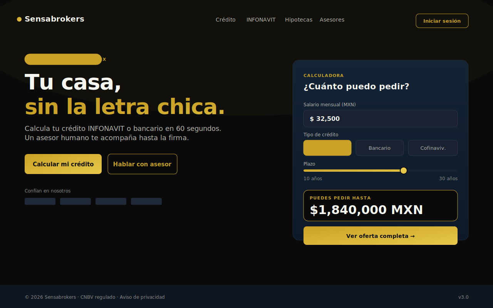
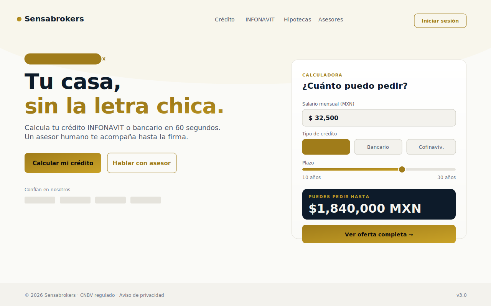

# Sensabrokers — Brand Guidelines

> Sub-issue [SEN-70](/SEN/issues/SEN-70) · Parent [SEN-68](/SEN/issues/SEN-68).
> Source of truth for visual identity. Implementation tokens live in
> `src/app/globals.css` and are exposed as Tailwind v4 utilities via `@theme inline`.

Sensabrokers is a mortgage brokerage for INFONAVIT and bank credit in Mexico.
Our brand promise is **clarity over confusion**: complex financial decisions made legible,
fast, and human. Visual language is sober, premium, trustworthy — never flashy.

---

## 1. Palette

### Brand primitives

| Token              | Hex       | Use                                          |
| ------------------ | --------- | -------------------------------------------- |
| `--brand-navy`     | `#0D1B2A` | Headers / dark surfaces in light mode        |
| `--brand-gold`     | `#C9A227` | Primary accent — CTAs, links, key emphasis   |
| `--brand-gold-light` | `#E8C84A` | Hover/active accent (dark mode)              |
| `--brand-gold-dark`  | `#A07C1A` | Accent on light backgrounds (AA contrast)    |
| `--brand-ink`      | `#0A0A0A` | Deep black — text on gold, dark mode page bg |
| `--brand-bone`     | `#F5F5F0` | Off-white — text on dark, light mode tints   |
| `--brand-gray`     | `#8A8A8A` | Neutral mid-gray                              |

> **Rule:** components should consume **semantic tokens** (below), not brand primitives directly.
> Primitives only exist to define the semantic layer.

### Semantic tokens (resolve per theme)

| Token              | Dark (default) | Light       | Role                           |
| ------------------ | -------------- | ----------- | ------------------------------ |
| `--surface-0`      | `#0A0A0A`      | `#FAFAF7`   | Page background                |
| `--surface-1`      | `#111827`      | `#FFFFFF`   | Cards, panels                  |
| `--surface-2`      | `#1A2232`      | `#F3F2ED`   | Raised, inputs                 |
| `--surface-3`      | `#2A3441`      | `#E8E6DF`   | Hover, overlays                |
| `--text-primary`   | `#F5F5F0`      | `#0D1B2A`   | Body & headings                |
| `--text-muted`     | `#B8B8B0`      | `#4A5568`   | Secondary copy                 |
| `--text-subtle`    | `#8A8A8A`      | `#6B7280`   | Helper, captions               |
| `--text-onbrand`   | `#0A0A0A`      | `#0A0A0A`   | Text over gold                 |
| `--border-subtle` | `#1F2937`      | `#E5E3DC`   | Card dividers                  |
| `--border-strong`  | `#2D3748`      | `#CFCDC4`   | Input borders                  |
| `--accent`         | `#C9A227`      | `#A07C1A`   | Primary action                 |

### Status

`--success #2ECC71` · `--warning #F5A623` · `--danger #E74C3C` · `--info #3498DB`

---

## 2. Typography

- **Family:** Geist Sans (UI), Geist Mono (numerals / code).
- **Scale:** Major Third (1.250), base 16px.

| Token         | Size       | Usage                       |
| ------------- | ---------- | --------------------------- |
| `--text-xs`   | 10.24 px   | Eyebrows, tags              |
| `--text-sm`   | 12.8 px    | Helper, captions            |
| `--text-base` | 16 px      | Body                        |
| `--text-md`   | 20 px      | Lead paragraph              |
| `--text-lg`   | 25 px      | Section subhead             |
| `--text-xl`   | 31.25 px   | h3                          |
| `--text-2xl`  | 39.06 px   | h2                          |
| `--text-3xl`  | 48.83 px   | h1 (page)                   |
| `--text-4xl`  | 61.04 px   | Hero                        |

Line-height: `--leading-tight 1.15` (display) · `--leading-snug 1.3` (headings) ·
`--leading-normal 1.5` (body) · `--leading-relaxed 1.7` (long-form).

Weights: 400 / 500 / 600 / 700. Avoid 300 — fails on small screens.

---

## 3. Spacing, Radii, Shadows, Motion

- **Spacing:** 4 px base. Tokens `--space-1` … `--space-24` (4, 8, 12, 16, 20, 24, 32, 40, 48, 64, 80, 96).
- **Radii:** `--radius-sm 4` · `md 8` · `lg 12` · `xl 16` · `2xl 24` · `pill 9999`.
- **Shadows:** `--shadow-sm` (subtle lift) · `--shadow-md` (cards) · `--shadow-lg` (modals) · `--shadow-gold` (CTA hover only).
- **Motion:** durations `fast 120ms` · `base 200ms` · `slow 320ms` · `slower 480ms`.
  Eases: `--ease-out` for entrances, `--ease-standard` for taps, `--ease-in-out` for reversible.

---

## 4. Voice & tone

Spanish (México) by default. Plain language. Numbers first, jargon second.

- **Confident, not pushy.** "Te decimos cuánto puedes pedir" beats "¡Solicita YA!".
- **Concrete, not vague.** "Tu mensualidad: $8,420 MXN" beats "Pagos accesibles".
- **Empathetic with the process.** A mortgage is stressful — acknowledge it, then simplify it.
- **No exclamation marks** in product UI. Reserve them for explicit celebration moments.

### Do / Don't

| ✅ Do                                                                | ❌ Don't                                                     |
| -------------------------------------------------------------------- | ------------------------------------------------------------ |
| "Calcula tu crédito INFONAVIT en 60 segundos."                       | "¡¡La MEJOR opción de crédito!!"                             |
| "Te conectamos con un asesor humano cuando lo necesites."            | "Resuelve todo solo con nuestra IA revolucionaria."          |
| Numbers right-aligned, monospaced, two decimals, MXN explicit.       | Mixed currency formats, decorative fonts on figures.         |
| Gold used for ONE primary action per view.                           | Two competing gold CTAs on the same screen.                  |
| Dark navy on bone, or bone on ink — AA contrast minimum.             | Gold text on bone — fails contrast.                          |
| Rounded `md` (8px) on inputs and buttons consistently.               | Mixing pill, sharp, and rounded corners on the same form.    |

---

## 5. Mockups

Two refined directions for the board to choose between. Both use the same tokens —
only the active theme value differs. Live preview: render `globals.css` and toggle
`:root.light` / default dark.

### Option A — Dark refined (default)

Premium feel, evening browsing, mobile-heavy traffic. Gold reads as luxury. Recommended
for marketing pages.

### Option B — Light refined

Daytime trust, banking association, accessibility-first. Navy headlines on bone surface.
Recommended for the customer dashboard / authenticated app.

> **Decision required:** the board picks one as the default site theme via the
> `request_confirmation` interaction on this issue. The other remains available as the
> opposite-mode override (toggled by `prefers-color-scheme` or `data-theme`).

---

## 6. Implementation notes

- Tokens are defined in `src/app/globals.css` and bridged into Tailwind v4 via
  `@theme inline`, so utilities like `bg-surface-1`, `text-muted`, `border-border-subtle`,
  `rounded-lg`, `shadow-md` resolve automatically.
- Theme switching: add `class="light"` or `data-theme="light"` on `<html>` to flip to
  light mode. Default is dark.
- Do not introduce new colors outside the token set. If a new use-case is needed, add it
  as a semantic token first, then consume it.
